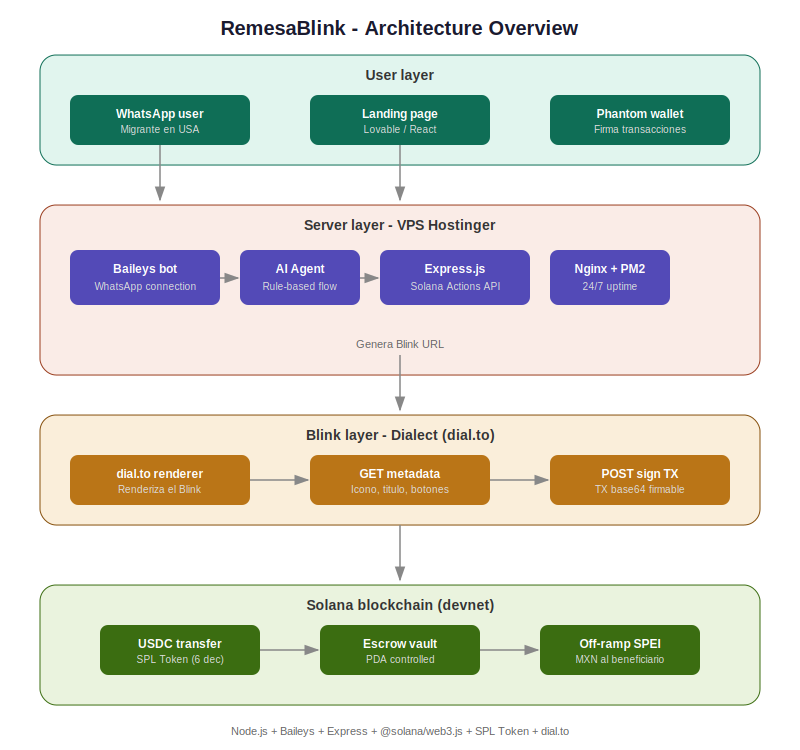

# 🌎 RemesaBlink

**Remesas instantáneas de USA a México usando USDC en Solana, vía WhatsApp.**

> Hackathon Solana x WayLearn — Marzo 2026

## 🎯 El Problema

El corredor de remesas USA-México mueve **$64.7 mil millones al año**. Los migrantes pagan entre 5-7% en comisiones con servicios tradicionales como Western Union o MoneyGram. Eso son miles de dólares que no llegan a las familias.

## 💡 La Solución

RemesaBlink es un bot de WhatsApp que permite enviar USDC (stablecoins) a través de Solana, con una comisión de solo **0.5%**. El beneficiario en México recibe pesos mexicanos vía SPEI.

**Sin apps nuevas. Sin wallets complicadas. Solo WhatsApp.**

## 🚀 Demo en Vivo

- **Landing Page:** [remesas-sin-limites.lovable.app](https://remesa-blink-ai.lovable.app/)
- **Blink URL:** [Probar en dial.to](https://dial.to/?action=solana-action:http://86.38.204.227/api/actions/remesa&cluster=devnet)
- **Server Health:** [http://86.38.204.227/health](http://86.38.204.227/health)

## 📱 Flujo del Usuario

```
1. Usuario escribe al bot: "Quiero enviar $200 a mi mamá"
2. Bot pregunta: monto → nombre → CLABE
3. Bot genera un Solana Blink (link de pago)
4. Usuario toca el link → Phantom se abre → firma la TX
5. USDC llega al escrow en Solana
6. Beneficiario recibe MXN vía SPEI
```

## 🏗️ Arquitectura



```
WhatsApp (Baileys) → Bot Node.js → Solana Actions API
                                         ↓
                                   dial.to (Blink)
                                         ↓
                                   Phantom Wallet
                                         ↓
                                   Solana Blockchain
                                     (USDC Transfer)
                                         ↓
                                   Off-ramp SPEI → MXN
```

## 🛠️ Stack Técnico

| Componente | Tecnología |
|---|---|
| Bot WhatsApp | Node.js + Baileys |
| Blockchain | Solana (devnet) + USDC SPL Token |
| Blinks/Actions | @solana/web3.js + Express.js |
| Renderizador | Dialect dial.to |
| Frontend | React + Vite + Tailwind (Lovable) |
| Hosting | Hostinger VPS + PM2 + Nginx |

## 📁 Estructura del Proyecto

```
├── src/
│   ├── index.js                 # Server Express + Actions
│   ├── actions/remesaAction.js  # GET/POST endpoints del Blink
│   ├── bot/whatsapp.js          # Bot WhatsApp (Baileys)
│   ├── ai/agent.js              # Conversación rule-based
│   └── utils/corsHeaders.js     # CORS para Solana Actions
├── frontend-src/                # Landing page (React)
├── frontend-public/             # Assets del frontend
├── package.json
└── .env.example
```

## ⚡ Instalación

```bash
git clone https://github.com/Alanbk101/1-remesa-blink.git
cd 1-remesa-blink
npm install
cp .env.example .env
# Editar .env con tus variables
node src/index.js
```

## 🔗 Endpoints

- `GET /api/actions/remesa` — Metadata del Blink (icono, título, botones)
- `POST /api/actions/remesa` — Genera transacción USDC firmable en base64
- `GET /health` — Status del servidor
- `GET /actions.json` — Discovery para wallets

## 📊 Ventaja Competitiva

| | Western Union | Felix Pago | **RemesaBlink** |
|---|---|---|---|
| Comisión | 5-7% | 1-2% | **2.5%** |
| Tiempo | 1-3 días | Minutos | **Segundos** |
| Interfaz | Sucursal/App | App propia | **WhatsApp** |
| Tecnología | Legacy | Parcial crypto | **Solana + Blinks** |

## 👨‍💻 Equipo

- **Alan** ([@Alanbk101](https://github.com/Alanbk101)) — Developer, WayLearn Solana Certified
- **Edgadafi** ([@Edgadafi](https://github.com/Edgadafi)) — Developer & Collaborator

## 📄 Licencia

MIT

---

*Hecho para el Hackathon Solana x WayLearn 2026* 🇲🇽🇺🇸
