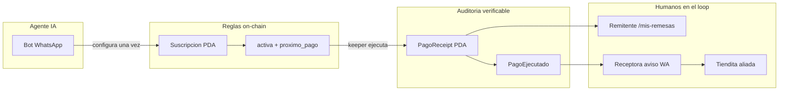
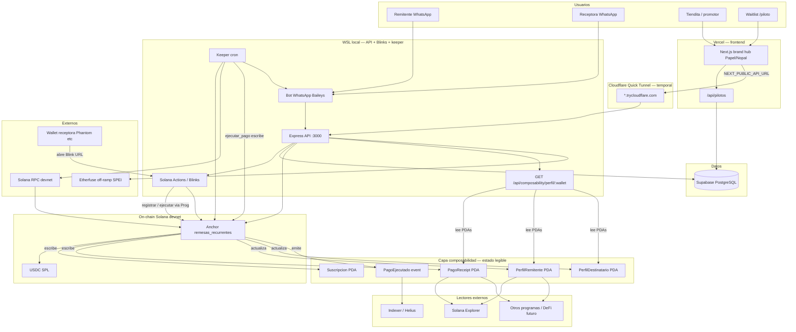
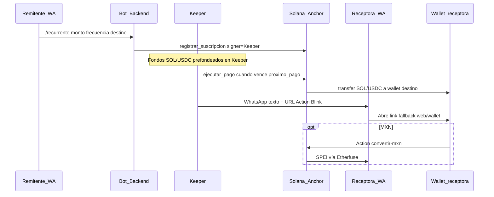
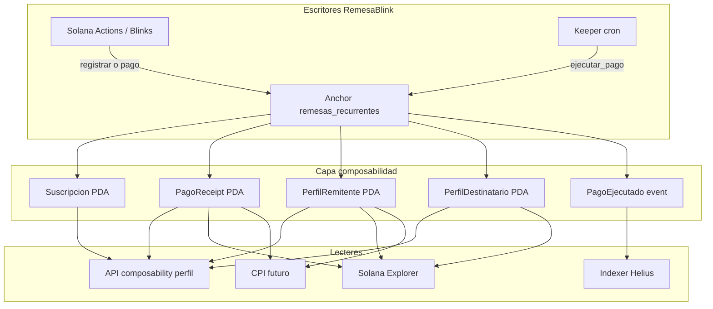
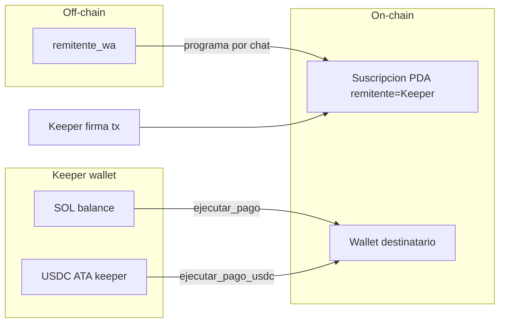
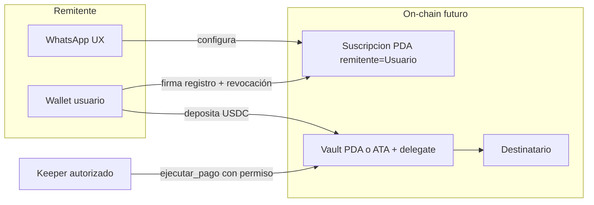
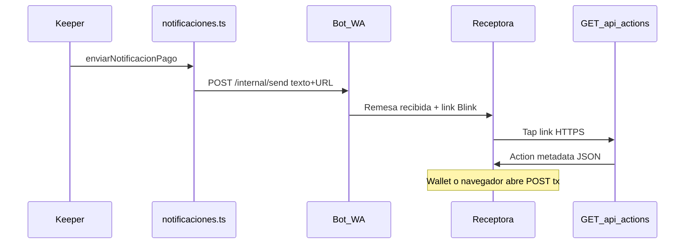
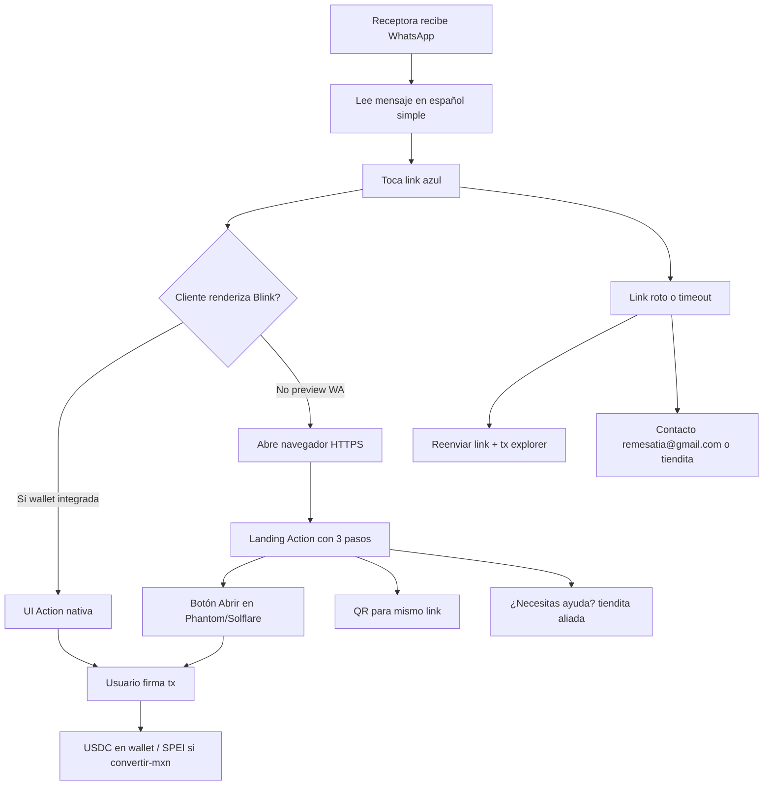
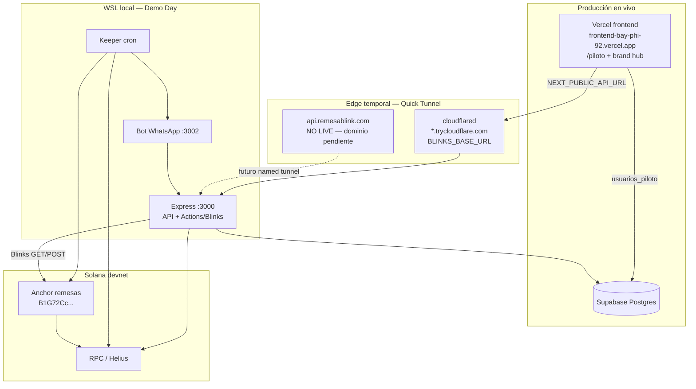

# RemesaBlink — Arquitectura On/Off-Chain

**Milestone 3 — WayLearn Solana Latam Labs Program**

---

## Portada


| Campo                    | Valor                                                                                                  |
| ------------------------ | ------------------------------------------------------------------------------------------------------ |
| **Proyecto**             | RemesaBlink (Remesa Blink)                                                                             |
| **Documento**            | Arquitectura On/Off-Chain — M3                                                                         |
| **Founder**              | Edgadafi                                                                                               |
| **Contacto**             | [quierochiachida@gmail.com](mailto:remesatia@gmail.com)                                                |
| **Fecha entrega M3**     | 10 de julio de 2026                                                                                    |
| **Demo Day**             | 31 de agosto de 2026                                                                                   |
| **Programa**             | [Solana Latam Labs — WayLearn](https://waylearn.gitbook.io/solana-latam-labs-program-waylearn)         |
| **Carpeta Drive equipo** | [Drive WayLearn](https://drive.google.com/drive/folders/1whLI4EutUbPz4OCVkwMFdeH5TZxkoQ8o?usp=sharing) |
| **Mentor WayLearn**      | Diana Torres e Isaac Klassen                                                                           |
| **Repositorio**          | [https://github.com/Edgadafi/remesa-blink](https://github.com/Edgadafi/remesa-blink)                   |
| **Program ID (devnet)**  | `B1G72CcRGHYc1UpG4o51VrJySLiwm3d7tCHbQiSb5vZ2`                                                         |
| **Clasificación**        | Confidencial · Uso interno incubación                                                                  |


*Julio 2026 · Confidencial · Programa WayLearn*

---


## Índice

1. [Resumen ejecutivo](#1-resumen-ejecutivo)
2. [Diagrama sistema (on/off-chain)](#2-diagrama-sistema-onoff-chain)
3. [Modelo de autorización de fondos](#3-modelo-de-autorización-de-fondos)
4. [Flujo WhatsApp → Blink y fallbacks UX](#4-flujo-whatsapp--blink-y-fallbacks-ux)
5. [Componentes y responsabilidades](#5-componentes-y-responsabilidades)
6. [Datos: source of truth](#6-datos-source-of-truth)
7. [Despliegue actual (devnet)](#7-despliegue-actual-devnet)
8. [Principales riesgos técnicos](#8-principales-riesgos-técnicos)
9. [Evolución post–Demo Day](#9-evolución-postdemo-day)
10. [Evidencias M3](#10-evidencias-m3)

---


## 1. Resumen ejecutivo

RemesaBlink combina **UX off-chain** (WhatsApp, landing, bot conversacional) con **lógica financiera verificable on-chain** (suscripciones Anchor, USDC/SOL, receipts y perfiles composables).

En el **MVP de incubación (devnet)** el modelo es **custodial vía keeper**: el remitente opera por WhatsApp sin wallet propia; una wallet operada por el equipo (**keeper**) prefondea SOL/USDC, registra la suscripción on-chain y ejecuta pagos recurrentes cuando vence `proximo_pago`.

### 1.1 Capa de confianza — agente, reglas, receipt, humanos

No automatizamos la confianza ciega: **automatizamos el envío**, pero cada ciclo queda **auditable on-chain** y **visible para la familia** off-chain. Modelo alineado con MVPs de IA en pagos (capa de control humano + trazabilidad):

| Capa | Qué hace | Componente |
| ---- | -------- | ---------- |
| **Agente** | Recibe intención en lenguaje natural; configura remesa recurrente | Bot WhatsApp + API |
| **Reglas** | Solo paga si `activa` y venció `proximo_pago`; monto y frecuencia en PDA | Programa Anchor |
| **Auditoría** | Recibo inmutable por pago + evento indexable | `PagoReceipt` + `PagoEjecutado` |
| **Humanos** | Remitente consulta `/mis-remesas`; receptora recibe aviso WA; aliado explica el link | Familia + tiendita |

**Pitch (1 frase):** *El agente en WhatsApp programa; Solana audita; tu familia vigila.*

Documento canónico del modelo de confianza: [TRUST-MODEL.md](./TRUST-MODEL.md). Esquema de cuentas: [PDA-ACCOUNTS.md](./PDA-ACCOUNTS.md).



Este documento responde al feedback del mentor WayLearn (M1):

1. **Qué significa “pago recurrente” técnicamente** — autorización, custodia y quién firma.
2. **Flujo WhatsApp → Blink** — qué pasa cuando el cliente no renderiza el Blink online.

---


## 2. Diagrama sistema (on/off-chain)


### 2.1 Vista de contexto




### 2.2 Flujo E2E principal




### 2.3 Capa de composabilidad (on-chain legible)

Blinks y el keeper **escriben** estado en el programa Anchor; otros clientes **leen** sin depender del mirror PostgreSQL. Esa capa es lo que hace el historial de remesas verificable y reutilizable (crédito/DeFi futuro, Explorer, indexers).




| Primitiva                                | Tipo   | Rol                                           |
| ---------------------------------------- | ------ | --------------------------------------------- |
| `Suscripcion` / `SuscripcionUsdc`        | PDA    | Calendario, monto, frecuencia, `proximo_pago` |
| `PagoEjecutado`                          | Evento | Indexación (Helius, backend)                  |
| `PagoReceipt`                            | PDA    | Recibo inmutable por pago (nonce)             |
| `PerfilRemitente` / `PerfilDestinatario` | PDA    | Agregados de reputación por wallet            |


**Puente UX:** `GET /api/composability/perfil/:wallet` lee PDAs vía RPC y opcionalmente el mirror `pagos`. Source of truth = on-chain.

Detalle técnico (seeds, CPI, identidad `usuario_remitente`): [COMPOSABILITY.md](./COMPOSABILITY.md) · [PDA-ACCOUNTS.md](./PDA-ACCOUNTS.md)


---


## 3. Modelo de autorización de fondos


### 3.1 Definición: “pago recurrente” en RemesaBlink


| Pregunta                             | MVP custodial (devnet, hoy)                         | Objetivo Fase E (post Demo Day)                              |
| ------------------------------------ | --------------------------------------------------- | ------------------------------------------------------------ |
| ¿Quién prefondea?                    | **Keeper** (wallet operada por el equipo)           | **Wallet del remitente** (vault PDA o ATA propia)            |
| ¿El programa retiene fondos?         | **No** — no hay escrow PDA en el programa           | Opcional: **vault PDA** con reglas de retiro                 |
| ¿Delegación SPL / approve USDC?      | **No** en MVP                                       | **Sí** — delegación limitada o approve revocable             |
| ¿Quién firma cada envío?             | **Keeper** (`ejecutar_pago` / `ejecutar_pago_usdc`) | Keeper con **permiso on-chain**; usuario no firma cada ciclo |
| ¿Quién firma el alta de suscripción? | **Keeper** como `remitente` en PDA                  | **Usuario** como `remitente` signer                          |
| ¿Remitente WhatsApp usa wallet?      | **No** (identidad off-chain `remitente_wa`)         | Wallet propia o smart wallet abstracted                      |
| ¿Identidad composable?               | Campo `usuario_remitente` en PDA (perfil/receipt)   | Misma wallet = authority económica                           |


### 3.2 Diagrama MVP — custodia keeper




**Reglas on-chain en cada ciclo:**

1. `suscripcion.activa == true`
2. `Clock >= suscripcion.proximo_pago`
3. Transfer desde cuenta **remitente** de la PDA (= keeper en MVP) hacia **destinatario**
4. Emisión de `PagoReceipt`, actualización de perfiles, evento `PagoEjecutado`

**Lo que NO es el MVP:** débito automático firmado por el usuario cada quincena; escrow custodial en smart contract; delegación Token-2022.

### 3.3 Diagrama objetivo — Fase E no-custodial




Roadmap detallado: [FASE-E-NO-CUSTODIAL.md](./FASE-E-NO-CUSTODIAL.md)

### 3.4 Tabla comparativa para pitch / mentores


| Dimensión          | MVP (M3–M5)                             | Fase E                          |
| ------------------ | --------------------------------------- | ------------------------------- |
| Riesgo operacional | Liquidez keeper; rotación de keys       | Riesgo distribuido al usuario   |
| UX remitente       | Máxima simplicidad (solo WA)            | Wallet o abstracción            |
| Compliance         | Validación piloto; no mainnet sin legal | NMLS / MSB según asesoría       |
| Composabilidad     | `usuario_remitente` ≠ authority fondos  | `usuario_remitente` = authority |
| Demo Day           | Honesto: “custodial devnet”             | Narrativa migración documentada |


---


## 4. Flujo WhatsApp → Blink y fallbacks UX


### 4.1 Limitación conocida

**WhatsApp no renderiza Solana Blinks** como Dialect, Phantom o X. La receptora recibe un **mensaje de texto con URL** (`Action` HTTP).

### 4.2 Flujo actual (implementado)




**URLs generadas por keeper** (`backend/src/keeper/cron.ts`):


| Condición                     | URL Action                                                                   |
| ----------------------------- | ---------------------------------------------------------------------------- |
| USDC + KYC Etherfuse verified | `/api/actions/convertir-mxn?amount=`                                         |
| USDC sin KYC                  | `/api/actions/enviar-remesa-usdc` + onboarding `/api/actions/onboarding-mxn` |
| SOL                           | `/api/actions/enviar-remesa?amount=&destination=`                            |


### 4.3 Árbol de fallback UX (M3 — especificación)




### 4.4 Copy WhatsApp (español simple — M3)

> **UX confianza:** pending / confirmed / failed diseñados — ver [UX-TRUST-DESIGN.md](./UX-TRUST-DESIGN.md) (sesión Pauline Moon, WayLearn jul 2026).

**Mensaje principal (post-pago):**

```
*Remesa recibida*

Recibiste {monto} {USDC|SOL} de tu familia.

1️⃣ Toca el link de abajo
2️⃣ Se abre una página segura
3️⃣ Confirma en tu app de wallet (Phantom u otra)

🔗 {blinkUrl}
```

**Si onboarding MXN pendiente:**

```
📋 Para recibir pesos en tu cuenta (SPEI), primero completa tu registro:
{onboardingUrl}
```

**Fallback humano:**

```
Si el link no abre, escribe a la tiendita que te refirió o a remesatia@gmail.com
con tu número. Te reenviamos el paso a paso.
```


### 4.5 Estado implementación vs. pendiente M4/M5


| Elemento                        | Estado                 |
| ------------------------------- | ---------------------- |
| Notificación WA con URL         | ✅ Implementado         |
| Actions GET/POST backend        | ✅ Implementado + tests |
| Página intermedia 3 pasos (web) | 📋 M4 — UX receptora   |
| Deep link Phantom / Solflare    | 📋 M4                  |
| Reenvío automático link caído   | 📋 M5                  |
| Demo en dispositivo real WA     | 📋 M5 Demo Day         |


---


## 5. Componentes y responsabilidades


| Componente                   | Stack              | Responsabilidad                                      |
| ---------------------------- | ------------------ | ---------------------------------------------------- |
| `anchor/remesas_recurrentes` | Rust / Anchor 0.32 | Suscripciones, pagos, receipts, perfiles             |
| `backend/` Express           | Node               | API REST, Blinks Actions, keeper cron, Solana client |
| `bot/` Baileys               | Node               | WhatsApp usuario + `/internal/send`                  |
| `frontend/` Next.js          | React              | Brand hub + `/piloto` waitlist, UI suscripciones     |
| Supabase                     | PostgreSQL         | Mirror off-chain, `usuarios_piloto`, RLS             |
| Vercel                       | Hosting            | Frontend prod (`frontend-bay-phi-92.vercel.app`)     |
| Cloudflare Quick Tunnel      | Tunnel temporal    | Expone Express :3000 vía `*.trycloudflare.com`       |
| Etherfuse                    | API                | Off-ramp MXN / KYC                                   |


---


## 6. Datos: source of truth

Fuente canónica (tabla extendida, gaps G1–G10, seeds PDA): [PDA-ACCOUNTS.md](./PDA-ACCOUNTS.md) §7.


| Dato                                | Source of truth             | Mirror off-chain                        |
| Suscripción activa, monto, schedule | PDA on-chain                | `suscripciones` (PG)                    |
| Pago ejecutado                      | `PagoReceipt` + evento      | `pagos` (PG)                            |
| Perfil reputación                   | PDA perfil                  | `GET /api/composability/perfil/:wallet` |
| Waitlist piloto                     | `usuarios_piloto` (PG)      | —                                       |
| Cashback promocional                | PG + futuro `reward_system` | —                                       |


---


## 7. Despliegue actual (devnet)

**Estado Demo Day (jul 2026):** frontend en Vercel; API + Blinks + keeper en WSL local expuestos con **Cloudflare Quick Tunnel** (`*.trycloudflare.com`). El hostname fijo `api.remesablink.com` es **aspiracional** — `remesablink.com` aún no está registrado (NXDOMAIN). Ver [CLOUDFLARE-TUNNEL.md](./CLOUDFLARE-TUNNEL.md).




| Servicio              | URL / notas                                                                                      |
| --------------------- | ------------------------------------------------------------------------------------------------ |
| Landing piloto        | [https://frontend-bay-phi-92.vercel.app/piloto](https://frontend-bay-phi-92.vercel.app/piloto)   |
| Frontend (Vercel)     | [https://frontend-bay-phi-92.vercel.app](https://frontend-bay-phi-92.vercel.app)                 |
| Backend + Blinks      | Cloudflare **Quick Tunnel** → Express `:3000` (`BLINKS_BASE_URL` = `*.trycloudflare.com`)       |
| Named API (pendiente) | `api.remesablink.com` — **no live**; `remesablink.com` NXDOMAIN                                  |
| DB                    | Supabase Postgres (`usuarios_piloto`, mirror suscripciones/pagos)                                |
| Program (devnet)      | `B1G72CcRGHYc1UpG4o51VrJySLiwm3d7tCHbQiSb5vZ2`                                                   |
| Explorer              | [https://explorer.solana.com/?cluster=devnet](https://explorer.solana.com/?cluster=devnet)       |


---


## 8. Principales riesgos técnicos

Tabla consolidada para revisión antes del desarrollo fuerte del MVP (M4–M5). Prioridad: lo que puede romper la demo E2E o la narrativa ante mentores e inversores.


| #   | Riesgo                                                                               | Área           | Impacto en MVP                                                                | Mitigación                                                                                                                                    | Estado          |
| --- | ------------------------------------------------------------------------------------ | -------------- | ----------------------------------------------------------------------------- | --------------------------------------------------------------------------------------------------------------------------------------------- | --------------- |
| R1  | **Custodia keeper** — liquidez SOL/USDC, rotación de keys, concentración operacional | On-chain / ops | Demo falla si keeper sin fondos; narrativa “no custodial” no aplica en devnet | Preflight `keeper:smoke` + balance USDC; documentar Fase E ([FASE-E-NO-CUSTODIAL.md](./FASE-E-NO-CUSTODIAL.md)); keys en `.env` nunca en repo | Activo (devnet) |
| R2  | **WhatsApp no renderiza Blinks** — solo URL en texto                                 | UX off-chain   | Receptora no crypto-native no entiende el link                                | Copy español simple (§4.4); landing 3 pasos + QR (M4); árbol fallback §4.3                                                                    | Parcial — M4 UX |
| R3  | **Receptora sin wallet o no abre link**                                              | UX             | E2E se corta después del pago on-chain                                        | Deep link Phantom/Solflare (M4); aliado tiendita; reenvío link + explorer (M5)                                                                | Pendiente M4/M5 |
| R4  | **Etherfuse / KYC SPEI**                                                             | API externa    | No convierte USDC → MXN en piloto                                             | Flujo demo USDC en wallet; onboarding KYC documentado; MXN como fase 2                                                                        | Piloto          |
| R5  | **Desincronía PG vs chain**                                                          | Datos          | UI/backend muestran estado incorrecto                                         | Source of truth on-chain para finanzas (§6); sync keeper post-tx; no confiar solo en mirror                                                   | Monitorear      |
| R6  | **Backend/bot en local + Quick Tunnel**                                              | Infra          | Demo inestable fuera de laptop; URL `*.trycloudflare.com` rota al reiniciar   | `npm run dev:tunnel`; named tunnel `api.remesablink.com` cuando haya dominio ([CLOUDFLARE-TUNNEL.md](./CLOUDFLARE-TUNNEL.md)); roadmap Render | Demo local      |
| R7  | **RPC devnet gratuito**                                                              | Solana         | Timeouts, tx no confirmadas en demo                                           | Retry + simulate; Helius/QuickNode antes de eventos críticos                                                                                  | Bajo            |
| R8  | **Baileys / sesión WhatsApp**                                                        | Bot            | Ban o desconexión = sin canal remitente                                       | Sesión dedicada piloto; fallback email/llamada; no escalar spam                                                                               | Piloto          |
| R9  | **Mainnet sin marco legal**                                                          | Compliance     | Bloqueo comercial, grants, alianzas                                           | No mainnet sin asesoría NMLS/MSB; honesto en pitch: “custodial devnet”                                                                        | Post Demo Day   |
| R10 | **Keeper como** `remitente` **en PDA**                                               | Composabilidad | Perfiles/receipts no reflejan wallet real del usuario                         | Campo `usuario_remitente` en PDA; migración Fase E con usuario signer                                                                         | Aceptado MVP    |


### Prioridad pre–Demo Day

1. **R2 + R3** — UX receptora (mayor riesgo de confusión en usuario real).
2. **R1** — liquidez y smoke tests antes de cada demo.
3. **R6** — túnel estable o deploy parcial para piloto fuera de local.


### Criterio de “riesgo cerrado” para M5

- Familia piloto completa un ciclo: WA remitente → pago keeper → notificación receptora → link abierto (wallet o landing) sin intervención manual del founder.

---


## 9. Evolución post–Demo Day

1. **Fase D** — CPI cashback `reward_system` desde `ejecutar_pago`
2. **Fase E** — no-custodial: vault/delegación, usuario signer en registro
3. **Mainnet** — solo tras legal + auditoría + RPC pago (Helius)
4. **Blink registry** — Dialect URL pública para previews fuera de WA

---


## 10. Evidencias M3


| Evidencia      | Ubicación                                                 |
| -------------- | --------------------------------------------------------- |
| Este documento | `docs/ARCHITECTURE-M3.md`                                 |
| PDF export     | `docs/M3-evidencias/RemesaBlink-Architecture-M3.pdf`      |
| Composabilidad | `docs/COMPOSABILITY.md`                                   |
| Tests Blinks   | `backend/tests/blinks.test.ts`                            |
| Program Rust   | `anchor/remesas_recurrentes/programs/.../lib.rs`          |
| Diagramas PNG  | `docs/M3-evidencias/diagrams/m3-01-*.png` … `m3-09-*.png` (incluye capa composabilidad) |
| Esquema PDAs   | [PDA-ACCOUNTS.md](./PDA-ACCOUNTS.md)                      |
| Modelo confianza | [TRUST-MODEL.md](./TRUST-MODEL.md)                       |


### Autoevaluación M3 (WayLearn)

- [x] Diagrama on/off-chain claro
- [x] Modelo autorización fondos MVP vs Fase E
- [x] Fallback WhatsApp → Blink especificado
- [x] Componentes y source of truth
- [x] Riesgos técnicos consolidados (§8)
- [x] PDF subido a Drive
- [x] Compartido con mentor Discord

---

*WayLearn Solana Latam Labs · RemesaBlink · Arquitectura M3 · Julio 2026*