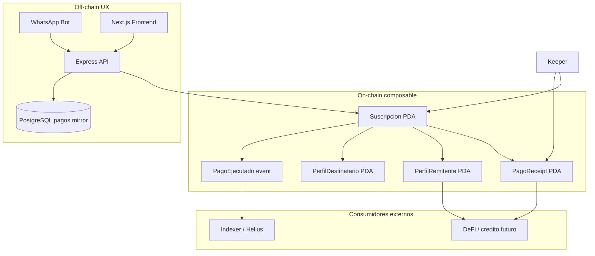

# Composabilidad On-Chain — Remesa Blink

Documentación técnica para Milestone 3 (arquitectura) y consumo por terceros.

**Diseño canónico:** [PDA-ACCOUNTS.md](./PDA-ACCOUNTS.md) (seeds, signers, source of truth) · [TRUST-MODEL.md](./TRUST-MODEL.md) (promesas y verificación).

## Resumen

Remesa Blink expone **historial de remesas verificable on-chain** mediante tres primitivas en el programa `remesas_recurrentes`:

| Primitiva | Tipo | Propósito |
|-----------|------|-----------|
| `PagoEjecutado` | Evento | Indexación (Helius, backend, indexers) |
| `PagoReceipt` | PDA | Recibo inmutable por pago |
| `PerfilRemitente` / `PerfilDestinatario` | PDA | Agregados de reputación por wallet |

**Program ID (devnet):** `B1G72CcRGHYc1UpG4o51VrJySLiwm3d7tCHbQiSb5vZ2`

### Por qué importa para la usuaria no bancarizada

La receptora rural (corredor MX ↔ EE.UU.) no tiene buró ni historial bancario. `PerfilDestinatario` acumula **remesas recibidas verificables on-chain** — base futura para microcrédito o DeFi sin exigir cuenta formal primero. Ver [PERSONA-MX-US.md](./PERSONA-MX-US.md) y registro de pilotos [VALIDACION-USUARIOS.md](./VALIDACION-USUARIOS.md).

---

## Diagrama on-chain / off-chain



---

## Seeds (PDA)

| Cuenta | Seeds |
|--------|-------|
| Suscripción SOL | `["suscripcion", keeper, destinatario]` |
| Suscripción USDC | `["suscripcion_usdc", keeper, destinatario, mint]` |
| Receipt | `["receipt", suscripcion_pda, nonce_le_u64]` |
| Perfil remitente | `["perfil_remitente", wallet]` |
| Perfil destinatario | `["perfil_destinatario", wallet]` |

---

## Identidad: `usuario_remitente`

El **keeper** firma y custodia fondos en MVP, pero `usuario_remitente` en la suscripción identifica la **wallet real del remitente** para composabilidad (eventos, receipts, perfiles).

**Confianza vs authority:** en MVP, `usuario_remitente` es identidad composable, no autoridad económica — ver [TRUST-MODEL.md](./TRUST-MODEL.md) §2.3 y [PDA-ACCOUNTS.md](./PDA-ACCOUNTS.md) §4.

- Web: se envía desde wallet conectada (`FormNuevaRemesa`).
- WhatsApp-only: default = pubkey del keeper hasta Fase E (no-custodial).

---

## Leer perfiles desde otro programa / cliente

### API (puente UX)

```bash
curl http://localhost:3000/api/composability/perfil/<WALLET_BASE58>
```

Respuesta incluye PDAs, agregados on-chain y mirror `pagos` off-chain.

### TypeScript (directo RPC)

```typescript
import { getPerfilRemitentePda, fetchPerfilRemitente } from "./services/solana";

const wallet = new PublicKey("...");
const perfil = await fetchPerfilRemitente(wallet);
// perfil.totalEnviado, perfil.pagosCompletados, ...
```

### Anchor / CPI (futuro)

Un protocolo de crédito puede leer `PerfilRemitente` en CPI antes de emitir un préstamo:

```rust
let perfil = Account::<PerfilRemitente>::try_from(&perfil_remitente_info)?;
require!(perfil.pagos_completados >= 12, ErrorCode::HistorialInsuficiente);
```

---

## Evento `PagoEjecutado`

Campos: `suscripcion`, `usuario_remitente`, `destinatario`, `monto`, `mint` (`1111...` = SOL), `timestamp`, `nonce`.

Indexar vía logs de transacción o webhook Helius `PROGRAM_LOG`.

---

## Tabla `pagos` (PostgreSQL)

Mirror off-chain para bot/WA — **no** source of truth. On-chain: receipts + eventos.

```bash
npm run db:schema
```

---

## Fases futuras

### Fase D — `reward_system` (base implementada)

Program ID: `BMvqgrBD8Co4aCFzbsyyfL6gvgaqTXpHfSwvjSbF4fH3`

- Instrucción `acumular_cashback`
- PDA `["cashback", wallet]`
- CPI desde `ejecutar_pago` en release posterior

### Fase E — No-custodial (post Demo Day)

- Remitente = wallet del usuario (authority económica)
- Keeper con delegación SPL o approve limitado
- Documentar en checklist de mainnet

---

## Redeploy

Tras cambios en `lib.rs`:

```bash
cd anchor/remesas_recurrentes
anchor build
anchor deploy --provider.cluster devnet
```

Actualizar `PROGRAM_ID` en `backend/.env` si cambia. Suscripciones antiguas (layout previo) requieren re-registro.

---

## Referencias

- [ARCHITECTURE-M3.md](./ARCHITECTURE-M3.md) — entregable WayLearn M3 (autorización fondos, fallback WA→Blink)
- [ROADMAP-M1.md](./ROADMAP-M1.md) — visión producto
- [DEMO.md](../DEMO.md) — guión demo con composabilidad
- Programa: [`anchor/remesas_recurrentes/programs/remesas_recurrentes/src/lib.rs`](../anchor/remesas_recurrentes/programs/remesas_recurrentes/src/lib.rs)
