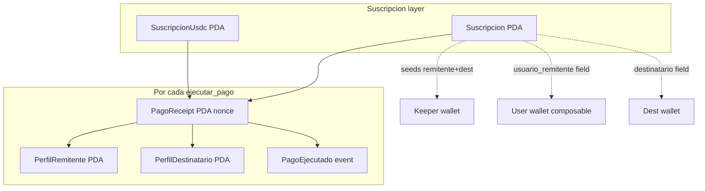
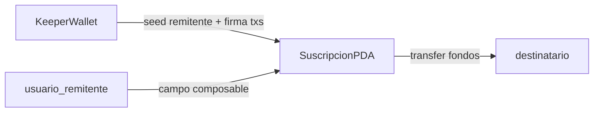
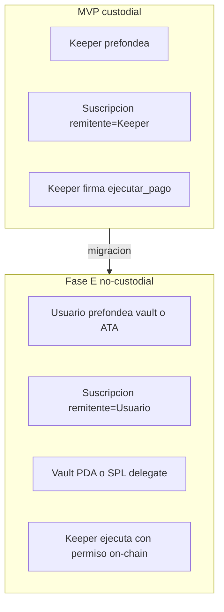

# Esquema de PDAs y cuentas — RemesaBlink

Documento canónico de cuentas on-chain, mirrors off-chain y evolución Fase E.

**Programa:** `remesas_recurrentes` · **Program ID (devnet):** `B1G72CcRGHYc1UpG4o51VrJySLiwm3d7tCHbQiSb5vZ2`  
**Modelo de confianza (producto):** [TRUST-MODEL.md](./TRUST-MODEL.md)  
**Arquitectura:** [ARCHITECTURE-M3.md](./ARCHITECTURE-M3.md) · **Composabilidad:** [COMPOSABILITY.md](./COMPOSABILITY.md)

---

## 1. Resumen MVP (custodial keeper)

En incubación (devnet), el **keeper** es simultáneamente:

- **Seed `remitente`** en la PDA de suscripción
- **Signer** de `registrar_*` y `ejecutar_*`
- **Fuente de fondos** (SOL balance + USDC ATA)

El campo **`usuario_remitente`** en la suscripción identifica la wallet real del remitente para **receipts, perfiles y eventos** — no autoriza fondos en MVP.

**No hay vault/escrow PDA** en el programa: el dinero no se retiene en el contrato.

---

## 2. Mapa de PDAs

| PDA | Seeds (bytes) | Space (data + 8 disc.) | Payer init | Bump en cuenta |
|-----|---------------|------------------------|------------|----------------|
| `Suscripcion` | `suscripcion` + remitente(32) + destinatario(32) | 139 | `remitente` signer | `suscripcion.bump` |
| `SuscripcionUsdc` | `suscripcion_usdc` + remitente + destinatario + mint(32) | 171 | `remitente` signer | `suscripcion_usdc.bump` |
| `PagoReceipt` | `receipt` + suscripcion_pda(32) + nonce_u64_le(8) | 137 | keeper (SOL) / authority (USDC) | `receipt.bump` |
| `PerfilRemitente` | `perfil_remitente` + usuario_remitente(32) | 73 | keeper / authority (`init_if_needed`) | `perfil_remitente.bump` |
| `PerfilDestinatario` | `perfil_destinatario` + destinatario(32) | 73 | keeper / authority (`init_if_needed`) | `perfil_destinatario.bump` |

**Nonce del receipt:** valor de `contador_pagos` **antes** del incremento en `ejecutar_pago*` (0-indexed).

**Mint sentinel SOL:** `Pubkey::default()` (`1111…1111`) en `PagoReceipt.mint` para pagos nativos.

### Programa Fase D — `reward_system`

| PDA | Seeds | Program ID (devnet) |
|-----|-------|---------------------|
| `CashbackBalance` | `cashback` + wallet(32) | `BMvqgrBD8Co4aCFzbsyyfL6gvgaqTXpHfSwvjSbF4fH3` |

Sin CPI desde `ejecutar_pago` en MVP; cashback operativo en PostgreSQL.

---

## 3. Grafo de dependencias (PDA map)



---

## 4. Identidad dual MVP



| Rol | MVP | Fase E (objetivo) |
|-----|-----|-------------------|
| `remitente` (seed + fondos) | Keeper | Wallet usuario |
| `usuario_remitente` | Wallet real o keeper default | = wallet usuario |
| Signer registro | Keeper | Usuario |
| Signer cada pago | Keeper | Keeper con permiso on-chain |

---

## 5. Cuentas no-PDA (flujo de fondos)

| Cuenta | Rol MVP | Validación on-chain |
|--------|---------|---------------------|
| Keeper SOL wallet | Origen transfer SOL | `address = suscripcion.remitente` |
| Keeper USDC ATA | Origen SPL transfer | `UncheckedAccount` (gap G6) |
| Destinatario SOL | Destino lamports | `address = suscripcion.destinatario` |
| Destinatario USDC ATA | Destino tokens | `UncheckedAccount` (gap G6) |

---

## 6. Instrucciones y signers

| Instrucción | Signers | Efecto |
|-------------|---------|--------|
| `registrar_suscripcion` | `remitente` (= keeper) | Crea PDA; `proximo_pago = now` |
| `ejecutar_pago` | `keeper` | Transfer SOL; receipt + perfiles + evento |
| `cancelar_suscripcion` | `remitente` (= keeper) | `activa = false` |
| `registrar_suscripcion_usdc` | `remitente` (= keeper) | Crea PDA USDC |
| `ejecutar_pago_usdc` | `authority` (= remitente/keeper) | Transfer USDC; receipt + perfiles |
| `cancelar_suscripcion_usdc` | — | **No existe (G2)** |

**Backend:** [`backend/src/services/solana.ts`](../backend/src/services/solana.ts) — siempre pasa `keeper.publicKey` como `remitente` en registro.

**Keeper cron:** [`backend/src/keeper/cron.ts`](../backend/src/keeper/cron.ts) — lista pendientes desde **PostgreSQL**, no lee PDA directamente.

---

## 7. Source of truth

| Dato | On-chain (autoritativo) | PostgreSQL (mirror) | Solo off-chain |
|------|-------------------------|---------------------|----------------|
| `activa` | PDA suscripción | `suscripciones.activa` | — |
| `proximo_pago`, `ultimo_pago` | PDA | `suscripciones.*` | — |
| `contador_pagos` | PDA | **No persistido (G4)** | — |
| `monto`, `frecuencia`, `tipo_activo` | PDA | `suscripciones.*` | — |
| `pda_address` | PDA pubkey | `suscripciones.pda_address` | — |
| `usuario_remitente` | PDA field | `usuario_remitente_solana` | — |
| `remitente` económico (keeper) | PDA field | **No persistido (G4)** | env `KEEPER_*` |
| `mint` USDC | PDA USDC | **No persistido (G4)** | env `USDC_MINT` |
| Receipt / nonce | `PagoReceipt` PDA | `pagos.receipt_pda`, `nonce` | — |
| Perfil agregados | Perfil* PDA | API fetch / index | — |
| Identidad WA | — | `remitente_wa`, `destinatario_wa` | Bot |
| Canal confianza | — | `usuarios_piloto.canal_confianza` | GTM |
| Cashback promocional | Fase D PDA (futuro) | `cashback_*` tables | — |

**Regla operativa:** la verdad **financiera** está on-chain (PDA + receipt). PG es mirror para cron, bot y UX — debe sincronizarse post-tx (backlog sprint siguiente).

---

## 8. Helpers backend (derivación PDA)

Implementados en [`backend/src/services/solana.ts`](../backend/src/services/solana.ts):

```typescript
getSuscripcionPda(remitente, destinatario)
getSuscripcionUsdcPda(remitente, destinatario, mint)
getPagoReceiptPda(suscripcionPda, nonce)  // nonce u64 LE
getPerfilRemitentePda(wallet)
getPerfilDestinatarioPda(wallet)
```

**Futuro:** centralizar en `backend/src/solana/pdas.ts` + tests unitarios de bytes vs Anchor.

---

## 9. MVP vs Fase E (cuentas)



Detalle roadmap: [FASE-E-NO-CUSTODIAL.md](./FASE-E-NO-CUSTODIAL.md)

| Dimensión | MVP | Fase E |
|-----------|-----|--------|
| Escrow PDA | No | Opcional vault |
| Delegación SPL | No | Sí (revocable) |
| Cancel USDC | No on-chain | `cancelar_suscripcion_usdc` |
| Perfiles / receipts | Preservados vía `usuario_remitente` | Misma clave composable |

---

## 10. Gaps conocidos (backlog implementación)

| ID | Gap | Prioridad | Owner sprint |
|----|-----|-----------|--------------|
| G1 | `cancelarSuscripcion()` solo PG; no llama `cancelar_suscripcion` on-chain | P0 | Backend + Anchor |
| G2 | No existe `cancelar_suscripcion_usdc` | P0 | Anchor |
| G3 | `proximo_pago`: chain `= now` al registrar; PG `= now + interval`; cron usa PG | P0 | Programa o sync |
| G4 | PG sin `remitente_solana`, `mint`, `contador_pagos` | P1 | DB migration |
| G5 | PerfilDestinatario por wallet, UX por WA | P2 | Producto |
| G6 | ATAs USDC `UncheckedAccount` sin owner/mint checks | P1 | Anchor |
| G7 | SOL `ejecutar_pago`: remitente no Signer (OK MVP) | Fase E | — |
| G8 | Rotación keeper rompe re-derivación PDA sin columna PG | P1 | DB + ops |
| G9 | Tests Anchor usan remitente arbitrario, no path custodial | P2 | Tests |
| G10 | `reward_system` sin helper `getCashbackPda` ni CPI | Fase D | Anchor |

Referencias código:

- Cancel off-chain: [`backend/src/services/suscripciones.ts`](../backend/src/services/suscripciones.ts) L132
- Register `proximo_pago`: [`lib.rs`](../anchor/remesas_recurrentes/programs/remesas_recurrentes/src/lib.rs) L42-48
- Schema PG: [`db/schema.sql`](../db/schema.sql)

---

## 11. Fuera de alcance (documentado, no implementado)

- `cancelar_suscripcion_usdc` + wire backend
- Migración PG + sync post-tx PG ← chain
- Validación estricta ATA USDC
- Vault PDA / SPL delegate (Fase E)
- CPI `reward_system` desde `ejecutar_pago`
- Página Action intermedia receptora (M4 UX)

---

*WayLearn · RemesaBlink · PDA & Accounts · Jul 2026*
