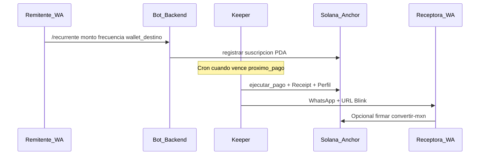

# Milestone 1 — Roadmap Inicial del Producto

**Proyecto:** Remesa Blink  
**Entrega:** Viernes 26 de junio de 2026  
**Programa:** [Solana Latam Labs — WayLearn](https://waylearn.gitbook.io/solana-latam-labs-program-waylearn/milestones)

Versión copy-paste para mentores: [ROADMAP-M1-DRIVE.md](./ROADMAP-M1-DRIVE.md)

---

## 1. Problema que busca resolver

Familias en el corredor México ↔ EE.UU. dependen de **remesas recurrentes** para consumo básico. Hoy el flujo es manual, caro y repetitivo: colas en OXXO o Western Union, INE vigente, límites por transacción (~$3k–4k MXN), comisiones opacas y desplazamiento en zonas rurales donde no hay sucursales bancarias.

La **receptora primaria** (~60–70% mujeres, 40–60+, rural) queda fuera del sistema formal: sin historial crediticio, con desconfianza hacia bancos y preferencia por redes familiares y tienditas de confianza. Cada mes repite el mismo trámite físico aunque el monto y el remitente sean los mismos.

**Oportunidad técnica:** un historial de pagos **verificable on-chain** (receipts + perfiles) puede convertirse en reputación financiera portable para crédito o DeFi futuro — sin depender de buró tradicional.

Fuente persona: [PERSONA-MX-US.md](./PERSONA-MX-US.md)

---

## 2. Usuario objetivo

| Usuario | Perfil | Job-to-be-done |
|---------|--------|----------------|
| **Primario** | Receptora rural MX, 40–60+, sub-bancarizada | Recibir apoyo recurrente sin ir cada mes a OXXO |
| **Secundario** | Remitente diáspora (CA/TX), $200–800/mes | Programar envío y olvidarse; avisar por WhatsApp |
| **Canal GTM** | Tiendita / comerciantes / PYMEs / asociación migrante | Generar confianza local + disposición a probar tecnología |

**No es** joven crypto-native; **sí** usa WhatsApp con la familia.

### Canales de confianza (GTM)

No vendemos directo a la receptora sin mediador. Priorizamos **tienditas de barrio**, **redes de comerciantes** y **comunidades de PYMEs** locales abiertas a WhatsApp y links de pago. Complementamos con **asociaciones de migrantes** en EE.UU. para captar remitentes. La iglesia puede ser contacto secundario en algunas zonas, pero **no es el canal principal**.

| Perfil aliado | Métrica de éxito |
|---------------|------------------|
| Dueño/a tiendita abarrotes (MX) | ≥3 familias referidas; 1 par E2E |
| Coordinador/a CANACO / comerciantes | ≥15 asistentes demo; ≥5 leads |
| Admin grupo WA emprendedores/PYMEs | ≥50 clicks landing; ≥10 registros |
| Presidente club oriundos (Houston, Dallas, LA) | ≥5 remitentes; ≥3 pares familia en DB |
| Promotor/a microfinanzas | ≥5 entrevistas; ≥2 receptoras en piloto |

**Prioridad piloto:** tiendita MX + asociación migrante EE.UU. → 1 flujo E2E antes de escalar.

**Landing waitlist:** `/piloto`, meta **10 familias piloto**. Spec: [LANDING-WAITLIST-SPEC.md](./LANDING-WAITLIST-SPEC.md). Marca: [BRAND-IDENTITY.md](./BRAND-IDENTITY.md).

Protocolo pilotos: [VALIDACION-USUARIOS.md](./VALIDACION-USUARIOS.md)

---

## 3. Funcionalidades principales del MVP

### Must-have (Demo Day) — estado al 26 jun 2026

| Must-have | Estado actual | Pendiente incubación |
|-----------|---------------|----------------------|
| Suscripciones SOL/USDC (Anchor) | Hecho (devnet) | Redeploy estable post-composabilidad |
| Keeper cron + pagos automáticos | Hecho | Deploy público + alertas saldo |
| Bot WhatsApp + API Express | Hecho | 1 familia piloto real |
| Blinks (Solana Actions) | Hecho | Registry Dialect en URL pública |
| Frontend + wallet connect | Hecho | UX mensajes simples ES |
| Off-ramp MXN (Etherfuse) | Integrado | E2E KYC verificado en piloto |
| Composabilidad (eventos, receipts, perfiles) | Hecho en código | Mostrar en demo M5 |
| Registro pilotos (`usuarios_piloto`) | Hecho (API + landing `/piloto`) | 3+ contactos reales |
| Landing waitlist `/piloto` | Hecho (Vercel) | Backend público + form E2E |

### Nice-to-have

| Feature | Cuándo |
|---------|--------|
| Mainnet | Post-incubación |
| Modelo no-custodial | Fase E ([FASE-E-NO-CUSTODIAL.md](./FASE-E-NO-CUSTODIAL.md)) |
| Wallet-less onboarding receptora | Post-M5 |
| App móvil | Post-programa |
| DeFi hooks sobre perfiles | Post Demo Day |

### Fuera de scope (no prometemos en M5)

- Garantía de liquidez del keeper
- KYC ligero in-app (Etherfuse exige KYC completo + CLABE)
- Comisión propia desglosada al usuario
- Onboarding receptora sin wallet pubkey
- Mainnet sin validación y compliance

### Alcance MVP honesto (onboarding)

| Tema | Estado actual |
|------|---------------|
| Remitente | WhatsApp; **no requiere wallet** (keeper custodial) |
| Receptora | **Wallet pubkey** al suscribir; recibe Blink por WA |
| Costos tx | Fees Solana + rent receipt (keeper); sin comisión app |
| Liquidez | Keeper pre-fondeado SOL/USDC; sin garantía plataforma |

---

## 4. Qué esperamos al final de la incubación (31 ago)

- [ ] MVP **demostrable en devnet** (idealmente URL pública)
- [ ] Flujo E2E: suscripción → keeper → Blink → (USDC) MXN opcional
- [ ] **5–10 entrevistas** receptoras + **3–5 familias** en `usuarios_piloto`
- [ ] Receipt + perfil on-chain visibles en Explorer
- [ ] **10 familias piloto** landing `/piloto` (4/4/2 por rol)
- [ ] Pitch 3 min + demo 2 min ([DEMO.md](../DEMO.md))
- [ ] Base para postular a **grants Solana** (narrativa + tracción piloto)

---

## 5. Cómo se integra con Solana

| Capa Solana | Uso en Remesa Blink |
|-------------|---------------------|
| **Programa Anchor** (`remesas_recurrentes`) | Suscripciones recurrentes verificables |
| **USDC SPL** | Remesa en dólares digitales |
| **Solana Actions / Blinks** | Receptora recibe link en WA → firma en wallet |
| **PDAs composables** | Receipts + perfiles = historial portable |
| **Devnet → mainnet** | Solo tras validación y compliance |

**Program ID devnet:** `B1G72CcRGHYc1UpG4o51VrJySLiwm3d7tCHbQiSb5vZ2`

**Por qué Solana (no solo fintech tradicional):** costo y latencia por pago recurrente; Blinks nativos; USDC; ecosistema grants LATAM; composabilidad para crédito/DeFi futuro.

Detalle técnico composabilidad: [COMPOSABILITY.md](./COMPOSABILITY.md) (resumen — no duplicar fases A–E aquí).

**Primitivas clave:** `PagoEjecutado` (evento), `PagoReceipt` PDA, `PerfilRemitente` / `PerfilDestinatario` PDA, `usuario_remitente` en suscripción.

---

## 6. Flujo principal del producto

### Pasos narrados

1. **Remitente** programa remesa por WhatsApp (sin wallet propia en MVP custodial).
2. **Sistema** registra suscripción on-chain (keeper custodia fondos).
3. **Keeper** ejecuta pago al vencer; emite evento, crea receipt y actualiza perfil.
4. **Receptora** recibe mensaje + Blink (recibir USDC o completar KYC Etherfuse → MXN).
5. Cashback/referidos off-chain; **historial composable on-chain** para futuro crédito.

---

## 7. Roadmap por fechas WayLearn

| Fecha | Milestone | Entregable Remesa Blink |
|-------|-----------|-------------------------|
| **26 jun** | M1 Roadmap | Este doc → Drive |
| **3 jul** | M2 Business | 3 entrevistas + pilotos en DB |
| **10 jul** | M3 Arquitectura | Diagrama on/off-chain |
| **31 jul** | M4 Validación | 5–10 entrevistas + cambios producto |
| **21 ago** | M5 MVP funcional | Demo URL + video E2E + repo |
| **28 ago** | M6 Pitch readiness | Deck 8–10 slides |
| **31 ago** | Demo Day | Pitch + demo en vivo |

**Jul–ago (desarrollo):** deploy staging, 1 familia piloto E2E, E2E Etherfuse MXN, polish WhatsApp ES, landing `/piloto` en producción.

---

## 8. Evidencias (anexos Drive)

| Evidencia | Ubicación |
|-----------|-----------|
| Roadmap PDF | Google Doc export |
| E2E funcional | `docs/M1-evidencias/` — logs `e2e:sol` / `e2e:usdc` |
| Solana on-chain | Explorer devnet — tx + Receipt PDA |
| Composabilidad API | `GET /api/composability/perfil/:wallet` |
| Frontend | Screenshot `:3003` y `/piloto` |
| Repositorio | GitHub + [README.md](../README.md) |

Checklist upload: [M1-UPLOAD-DRIVE.md](./M1-UPLOAD-DRIVE.md)

---

## 9. Landing waitlist (10 familias piloto)

- **Ruta:** `/piloto` — implementada en Next.js · **Producción:** https://frontend-bay-phi-92.vercel.app/piloto
- **Meta:** 10 familias piloto (4 remitente / 4 receptora / 2 promotor)
- **Integración:** `POST /api/pilotos`, contador `GET /api/pilotos`
- **GTM:** links `?ref=comerciantes|migrantes|pyme|tiendita`
- **Marca v1.0:** [BRAND-IDENTITY.md](./BRAND-IDENTITY.md)

---

## Autoevaluación M1 (criterio WayLearn)

| Criterio | Estado |
|----------|--------|
| Problema, usuario, MVP, fin incubación y Solana claros en ~10 min | Sí |
| Roadmap por 7 milestones oficiales | Sí |
| Must-have / nice-to-have priorizados con estado honesto | Sí |
| Flujo principal (diagrama + texto) | Sí |
| Por qué Solana: argumento no técnico + detalle breve | Sí |
| Alcance realista (sin prometer mainnet, liquidez, KYC ligero) | Sí |
| Evidencias preparadas en `docs/M1-evidencias/` | Sí — logs 42 tests + build; capturas Explorer pendientes |
| Documento subido a Drive | Pendiente — ver [M1-UPLOAD-DRIVE.md](./M1-UPLOAD-DRIVE.md) |

---

*WayLearn Solana Latam Labs · Demo Day 31 ago 2026*
