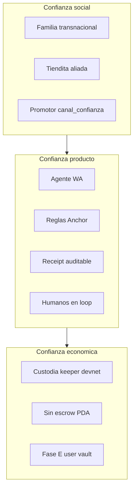
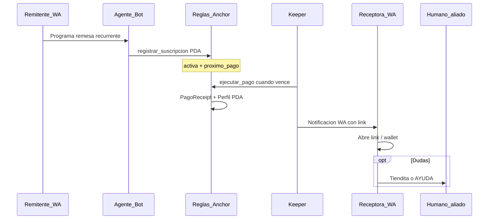
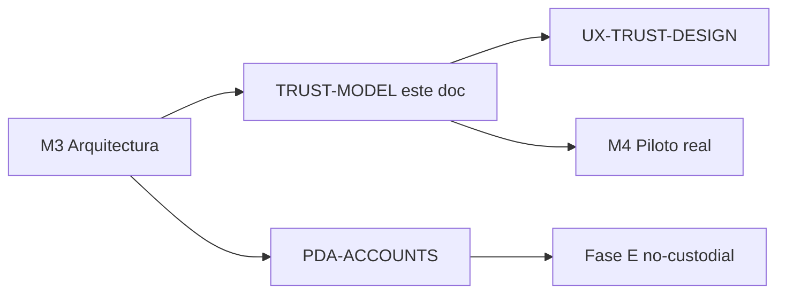

# Modelo de confianza — RemesaBlink

Qué promete RemesaBlink, cómo se verifica, y cuáles son los límites honestos del MVP.

**Esquema de cuentas:** [PDA-ACCOUNTS.md](./PDA-ACCOUNTS.md)  
**UX (copy WA, estados pending/ok/error):** [UX-TRUST-DESIGN.md](./UX-TRUST-DESIGN.md)  
**Pitch:** [PITCH-TRUST-LAYER.md](./PITCH-TRUST-LAYER.md)  
**Persona:** [PERSONA-MX-US.md](./PERSONA-MX-US.md)

**Principio rector:** *Nosotros estamos vendiendo confianza* — no automatizamos la confianza ciega; automatizamos el envío con trazabilidad y humanos en el loop.

**Pitch (1 frase):** *El agente en WhatsApp programa; Solana audita; tu familia vigila.*

---

## 1. Cuatro capas de confianza (producto)

| Capa | Promesa al usuario | Evidencia verificable | Componente |
|------|-------------------|----------------------|------------|
| **Agente** | “Programo una vez en WhatsApp” | Comando `/recurrente` + suscripción activa | Bot + API |
| **Reglas** | “Solo paga si toca y está activa” | PDA `activa`, `proximo_pago`, `Clock` | Anchor |
| **Auditoría** | “Cada envío deja comprobante” | `PagoReceipt` + Explorer + evento `PagoEjecutado` | On-chain |
| **Humanos** | “Mi familia ve el aviso” | WA post-pago; tiendita aliada; `/mis-remesas` | Bot + `canal_confianza` |

Estas capas responden a la tendencia observada en MVPs de IA + pagos: **el agente ejecuta; la confianza la construyen reglas verificables + supervisión humana**.

---

## 2. Tres dominios de confianza

### 2.1 Confianza social

- Corredor MX ↔ EE.UU.; receptora rural a menudo no bancarizada ([PERSONA-MX-US.md](./PERSONA-MX-US.md)).
- Adopción vía **redes existentes**: tiendita, comerciantes, asociación migrante, familia.
- Campo `usuarios_piloto.canal_confianza` documenta el puente social.
- **No sustituye** prueba técnica: complementa el primer contacto y el soporte cuando el link falla.

### 2.2 Confianza producto (4 capas)

Flujo E2E de confianza verificable:

### 2.3 Confianza económica

| | MVP (devnet, honesto) | Fase E (objetivo) |
|--|----------------------|-------------------|
| Quién tiene los fondos | Keeper prefondeado | Usuario (vault/ATA) |
| Quién firma cada ciclo | Keeper | Keeper con permiso; usuario no firma cada vez |
| Delegación / escrow | No | Vault PDA o SPL delegate revocable |
| Narrativa pública | “Piloto custodial devnet” | Usuario controla fondos |

Ver [PDA-ACCOUNTS.md](./PDA-ACCOUNTS.md) §9 y [FASE-E-NO-CUSTODIAL.md](./FASE-E-NO-CUSTODIAL.md).

---

## 3. Qué decimos / qué no decimos (MVP)

| Sí prometemos | No prometemos en MVP |
|---------------|-------------------|
| Remesa recurrente programada desde WhatsApp | Que el remitente custodie en su wallet |
| Comprobante on-chain por pago (`PagoReceipt`) | Delegación SPL revocable del usuario |
| Aviso a la familia en WhatsApp | Que WA renderice Blinks nativamente |
| Historial composable por wallet (`Perfil*`) | Mainnet / cumplimiento NMLS sin asesoría |
| Soporte humano (tiendita, email, AYUDA) | Tipo de cambio MXN fijo en notificaciones |

---

## 4. Matriz promesa → prueba (Demo Day)

| Promesa (demo / pitch) | Prueba técnica | Prueba UX |
|------------------------|----------------|-----------|
| “Remesa programada” | Tx `registrar_suscripcion*` + PDA en Explorer | WA confirmación remitente (`bot/src/copy.ts`) |
| “Pago automático en ciclo” | Tx `ejecutar_pago*` + `PagoReceipt` | Log keeper + notificación receptora |
| “Comprobante auditable” | `PagoReceipt` PDA + `GET /api/composability/perfil/:wallet` | Link Explorer colapsado (“ver detalle técnico”) |
| “Familia informada” | `enviarNotificacionPago` → bot | Copy receptora (`notificaciones.ts`) |
| “Confianza local” | `usuarios_piloto` + `canal_confianza` | Entrevistas M4 + aliado tiendita |

---

## 5. Mensajes públicos alineados

| Canal | Mensaje | Capa que refuerza |
|-------|---------|-------------------|
| Redes (one-liner #3) | “¿Cada quincena la misma fila en OXXO? RemesaBlink: dollars in, pesos en casa — automático por WhatsApp.” | Agente + outcome familiar |
| Landing `/piloto` | “El agente ejecuta; Solana deja comprobante; tu familia vigila.” | Producto 4 capas |
| WA receptora | “Es el mismo aviso que te manda tu familiar — no es spam.” | Humanos + social |
| Pitch mentor | Custodial devnet explícito + Fase E documentada | Económica honesta |

---

## 6. Límites de confianza (riesgos)

Cruce con [ARCHITECTURE-M3.md](./ARCHITECTURE-M3.md) §8 (riesgos técnicos):

| Riesgo | Impacto en confianza | Mitigación diseñada |
|--------|---------------------|---------------------|
| WA no renderiza Blinks | Receptora confundida | Copy 3 pasos + tiendita + AYUDA |
| Drift PG ↔ chain | Cron vs reglas divergen | Backlog sync (G3) — [PDA-ACCOUNTS.md](./PDA-ACCOUNTS.md) |
| Custodia keeper | Usuario confía en equipo, no en wallet propia | Honestidad MVP + Fase E |
| Cancel solo PG | “Cancelé” pero chain sigue activa | Backlog G1/G2 |
| Etherfuse / KYC | No convierte a MXN | Flujo USDC + onboarding documentado |

---

## 7. Evolución del modelo

**M4 (validación):** entrevistas capturan objeciones de confianza (“¿qué necesitas ver para confiar en un bot con tu dinero?”) — alimentan UX y Fase E.

**Fase E:** confianza económica migra al usuario; capas producto (receipt, reglas, humanos) se mantienen.

---

## 8. Referencias cruzadas

| Documento | Rol |
|-----------|-----|
| [ARCHITECTURE-M3.md](./ARCHITECTURE-M3.md) §1.1 | Capa confianza en arquitectura |
| [COMPOSABILITY.md](./COMPOSABILITY.md) | `usuario_remitente` vs authority |
| [VALIDACION-USUARIOS.md](./VALIDACION-USUARIOS.md) | Protocolo entrevistas + pilotos |
| [UX-TRUST-DESIGN.md](./UX-TRUST-DESIGN.md) | Estados UI/WA Pauline Moon session |

---

*WayLearn · RemesaBlink · Trust Model · Jul 2026*
